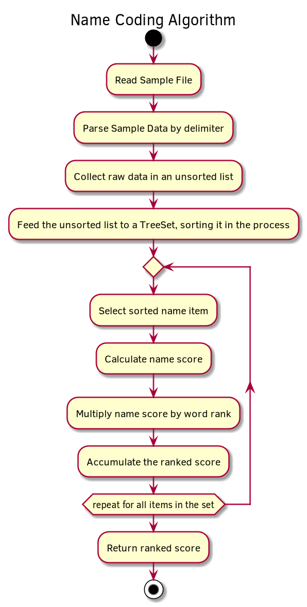
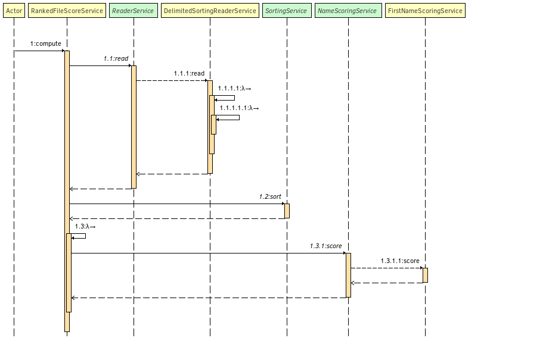

# name-coding
[]( https%3A%2F%2Fg.codefresh.io%2Fpublic%2Faccounts%2Fbalamuru%2Fpipelines%2Fnew%2F5ed76e90ccb58a9eeea8392c)
## QuickStart
See [here](docs/quickstart.md) for instructions on building and execution

## Sample output
```
$ java -jar name-coding-cli-1.0-SNAPSHOT-jar-with-dependencies.jar --file /home/vinayb/Downloads/sample-large.txt 
Input file: /home/vinayb/Downloads/sample-large.txt
Total score: 871198282
```
## Problem Summary
Design a comman line application that accepts a list of names and outputs an aggregated score 
The underlying name-coding-lib is designed to be reused

## Detailed Problem Statement
_Create a command line utility that will compute a score for a list of first names.
The list of names will be provided as a text file. The full path to the names file will be specified as a command line argument. The names file will contain a single line of quoted, comma-separated names. A small sample of data can be found at the end of this document and a full sample file (names.txt) is attached.
To score a list of names, you must sort it alphabetically and sum the individual scores for all the names. To score a name, sum the alphabetical value of each letter (A=1, B=2, C=3, etc...) and multiply the sum by the name’s position in the list (1-based)._

_For example, when the sample data below is sorted into alphabetical order, LINDA, which is worth 12 + 9 + 14 + 4 + 1 = 40, is the 4th name in the list. So, LINDA would obtain a score of 40 x 4 = 160. The correct score for the entire list is 3194_

```
"MARY","PATRICIA","LINDA","BARBARA","VINCENZO","SHON","LYNWOOD","JERE","HAI"
```
_**Future Requirements**_
* _Another department will want to use this utility as well, but they have a much more complex name scoring algorithm._
* _This scoring feature will be added to the company's intranet web-app, allowing employees to upload and score files from their desktop._
* _The company will be switching from first names only to both first and last names in the file._

## Requirements extracted from Problem Statement (and the chosen approach)
* Command line utility that accepts a single command line argument describing the fully qualified path to the input file
    * Fat Jar that can be executed 
    * Apache CLI to accept the ```--file``` argument
* Print the total ranked score to the console
    * Implemented in CLI
* Should be flexible enough to accomodate other scoring implementations, data structures etc 
    * interface driven design so all implementations can be switched out
    * 2 module approach
        * ```name-coding-lib``` contains the core services
        * ```name-coding-cli``` contains a CLI application that uses ```name-coding-lib``` and wired up with Spring 
* Should be flexible enough to be integrated into other apps and other sources of data
    * The input is a URL, so as long as the input text can be expressed as an URL, the library should work
* Should be flexible to support first and last names
    * The Pattern Delimiters and ReaderService are all interface driven and can support alternate implementation         
* Should be production-grade
    * Unit tests available
    * Spring wired CLI
    * Spring wired test configuration
    * Published on Github
    * GitHub code connected to remote CI/CD pipeline (hosted on https://codefresh.io/)

## Assumptions
* All Data is in a single text line 
* All names in the input are unique (no duplicates)
* No non-alphanumerics in the data set (apart fro whitespace, comma and quotes)
* Each name entry is prefixed and suffixed by ```"```

## Approach
* Read string and split into names
* Insert the data in a SortedSet
* Stream the sorted data
* For each datum, calculate the word score and multiply by its rank to determine its score
* Accumulate the score 
## Algorithm 


### Core Call Flow


### Complexity analysis as a function of number of records
For n records
* Insert + Sort: n*O(log(n)) (the data is sorted into a tree set at insertion time)
* Sort: O(1) (no-op, sorting performed at insert)
* Scoring: O(n) (just iterate across records, calculate score and accumulate)

## Libs Used
* JUnit
* Apache Commons CLI
* SLF4J
* Spring core
* Maven assembly plugin

## Possible Future Enhancements:
* Containerize the CLI application so the executing environment does need to provide a JRE
* Parallelize the final ranking by 
  * iterating the sorted list in order
  * determining the tuple (order, word) and processing these in parallel
  * collecting the results
* Organizing the FileScoringService implementation as a set of chainable jobs, rather than just a facade for the calculation
* Using streaming approach for the final ranking allowing scale-out
   


